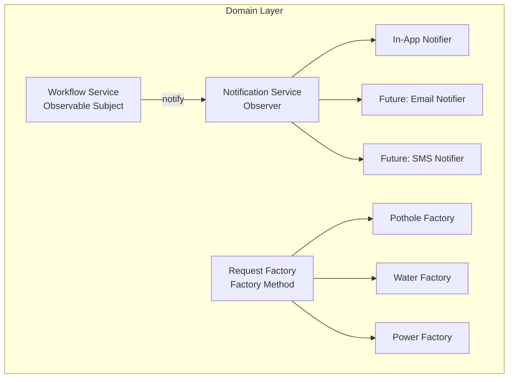

# Component view - Design Patterns Placement 

>**M2 Addition - PEDv2.0**

## Diagram 

| Pattern | Where | Purpose | 
|---|---|---|
| Observer | Workflow -> Notification | Add channels without editing workflow logic | 
|Factory Method | Request creation | One factory per category; no branching intake |

## Evidence 

- ADR-ARCH-01 (architecture context) 
- A2 Task 1 (design problems and pattern selection) 
- Memeber 2's ADRs (ADR-PERSIST-01, ADR-INT-01)