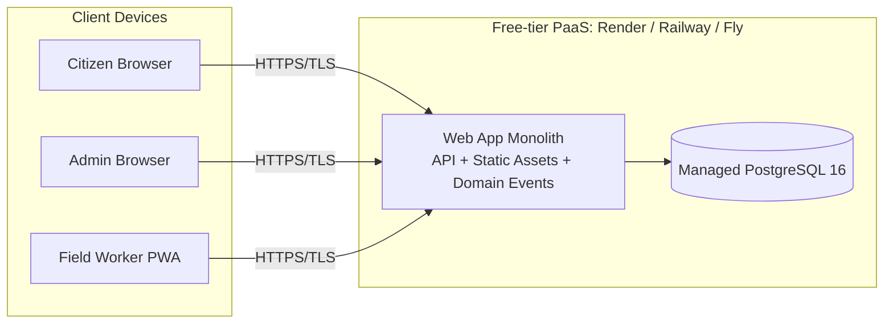

# Deployment View

>

## Diagram

## Deployment Direction

- **Single region** (multi-region out of scope per M2 brief)
- **Free-tier PaaS** hosts the monolith
- **Managed PostgreSQL** as the only separate tier
- **HTTPS/TLS** at boundary (NFR-03)
- **Stateless app** - all persistent state in Postgres

## Compatibility

| Selected Technology | PaaS Compatibility |
|---|---|
| Node 20 LTS |  Supported on all candidates |
| PostgreSQL 16 |  Managed add-on available |
| Prisma migrations |  Run at deploy time |
| Static assets (React build) |  Served from same host |
| Workbox PWA |  Browser-side, no server change |

## Deferred

- Specific hosting provider -> M3
- Multi-region -> not planned
- Production observability -> M3/M4

## Link

- PED: [07-architecture.md](../Project_Engineering_Document/07-architecture.md)
