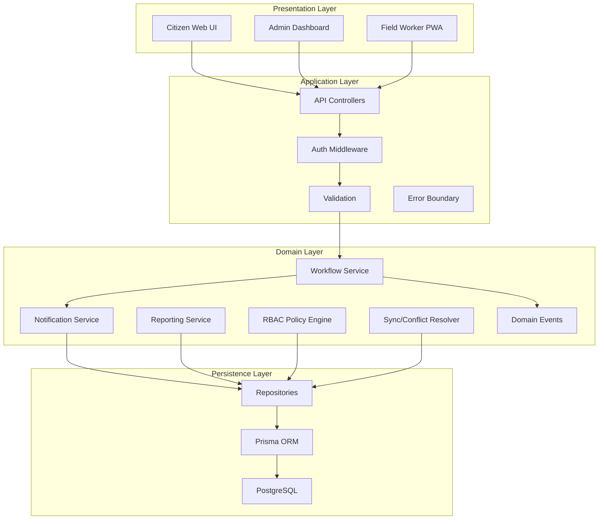

# Logical Architecture

> **M2 Addition - PED v2.0**

> **Linked ADR:** [ADR-ARCH-01](../Architecture_Decision_Record/ADR-ARCH-01-layered-monolith.md)

## Diagram

## Responsibilities

### Presentation Layer
- Rendering, client validation, offline caching, sync UI
- Three role-based views: Citizen, Admin, Field Worker PWA
- Communication over HTTPS/TLS (NFR-03)

### Application Layer
- HTTP handling, authentication, request validation
- Response shaping, error translation
- Rate limiting and boundary security

### Domain Layer
- Business rules, workflow state machine, domain events
- RBAC policy engine, sync/conflict resolution
- Observer and Factory Method pattern implementations 

### Persistence Layer
- Data access via repositories, transactional writes
- Prisma ORM, PostgreSQL, migrations
- Integrity constraints, append-only audit storage

## Notes

- All four logical layers run in a single deployable unit (ADR-ARCH-01)
- The database is the only separate physical tier
- Logical layers are a design concept, not physical deployment tiers