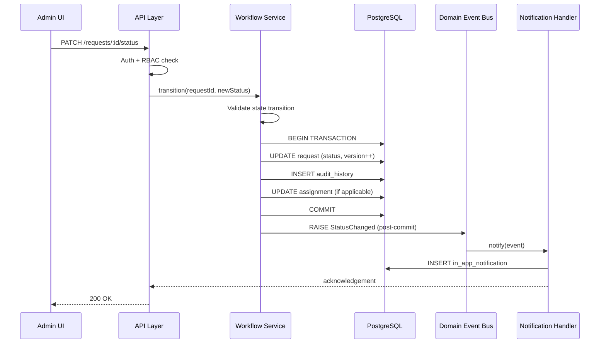

# Runtime View - Status Transition to Notification

## Diagram

## Key Properties

- **Atomicity:** All writes in single transaction (A2 Task 2) - status, audit, assignment
- **Post-commit event:** Notification never fires for rolled-back changes
- **In-process:** No network boundary (A2 Task 3)
- **Optimistic concurrency:** Version column on request row detects lost updates
- **Append-only audit:** Audit history records cannot be updated or deleted through normal application code

## ASRs Satisfied

- ASR-02 (Real-Time Status Transparency)
- ASR-03 (RBAC & Audit Accountability)
- ASR-08 (Audit Retention)

## Link

- PED: [07-architecture.md](../Project_Engineering_Document/07-architecture.md)
