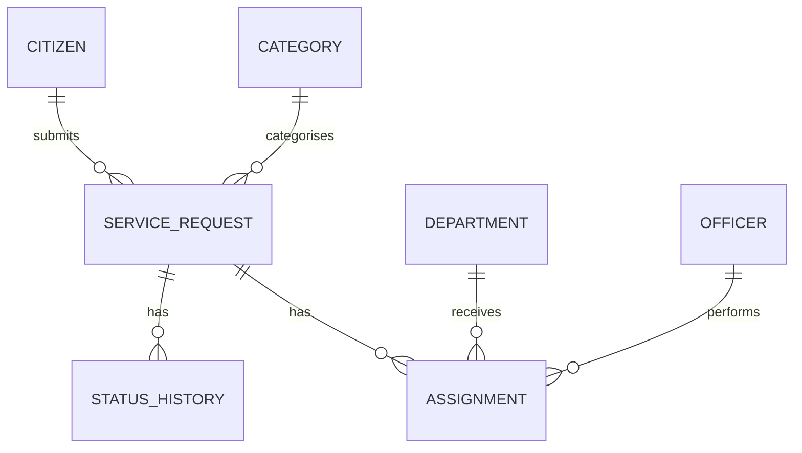

### 1. Data Persistence Requirements

CivicConnect requires persistent storage for citizen incident reports, service-request
status information, assignments, departmental information and the historical record of
status changes. The persistence model must support the submission and tracking of
municipal faults, offline synchronisation of field-worker updates, departmental
reporting and transparent request-status tracking. The initial data model is therefore centered on the ServiceRequest entity, with related
entities representing citizens, categories, departments, assignments and status history.

### 2. Initial Data Model
| Entity | Purpose |
|---|---|
| Citizen | Stores the user/citizen associated with a submitted service request. |
| ServiceRequest | Stores the main municipal incident or service fault. |
| Category | Identifies the category of the reported fault. |
| Department | Identifies the municipal department responsible for the request. |
| Assignment | Records the assignment of a request to a department and/or field worker. |
| StatusHistory | Stores the historical record of status transitions for a request. |
| Officer/FieldWorker | Represents the municipal employee responsible for an assigned request. |

The initial CivicConnect data model is centred on the `ServiceRequest` entity. Related
entities store the citizen who submitted the request, the category of the fault, the
department and officer responsible for the request, and the history of status changes.

### 3. ServiceRequest Entity

The ServiceRequest entity is the central persistent entity in CivicConnect. It
represents a citizen-reported municipal fault and stores the information required to
identify, locate and track the request. The initial attributes are:

| Attribute | Description |
|---|---|
| RequestID | Unique identifier for the service request. |
| CitizenID | Identifies the citizen who submitted the request. |
| CategoryID | Identifies the category of the reported fault. |
| Description | Description of the reported incident. |
| Photo/PhotoReference | Evidence associated with the incident report. |
| Latitude | Latitude recorded from the incident location. |
| Longitude | Longitude recorded from the incident location. |
| Status | Current status of the service request. |
| Version | Version value used for optimistic concurrency control. |
| CreatedAt | Date and time the request was created. |
| UpdatedAt | Date and time the request was last updated. |

### 4. StatusHistory and Audit Data
CivicConnect must retain a historical record of service-request status changes rather
than storing only the current status. This provides traceability for citizens,
administrators and other authorised users. The initial StatusHistory entity contains:

| Attribute | Description |
|---|---|
| HistoryID | Unique identifier for the history record. |
| RequestID | Foreign key referencing the related service request. |
| OldStatus | Status before the transition. |
| NewStatus | Status after the transition. |
| ChangedBy | User or worker responsible for the change. |
| ChangedAt | Date and time of the transition. |

StatusHistory records will be treated as append-only from normal application
operations. A previous history record should not be silently modified or deleted to
hide a correction; a correction should create a new history entry.

### 5. Assignment Data
The Assignment entity records the relationship between a service request and the
municipal department and/or field worker responsible for handling it. An initial Assignment structure is:

| Attribute | Description |
|---|---|
| AssignmentID | Unique identifier for the assignment. |
| RequestID | Foreign key referencing the service request. |
| DepartmentID | Foreign key identifying the responsible department. |
| OfficerID | Foreign key identifying the assigned field worker/officer where applicable. |
| AssignedAt | Date and time of assignment. |

Assignment data supports departmental routing and administrative visibility of
unresolved faults. It also forms part of the persistence boundary for a status
transition when an assignment changes.

### 6. Data Integrity
CivicConnect will use layered validation to protect data integrity. Application-layer validation will enforce business rules and workflow rules, such as
whether a particular status transition is permitted and whether a user has permission
to perform the operation. Database-level constraints will enforce structural integrity, including primary keys,
foreign keys, required fields and valid status values. Client-side validation will be treated as a usability mechanism rather than the sole
security or integrity control because client-side checks can be bypassed.

### 7. Persistence Design Problem
A key persistence problem is how CivicConnect should persist a service-request status
transition when the transition can involve multiple related records. A status transition may require:

1. Updating the current status of the ServiceRequest.
2. Inserting a StatusHistory record.
3. Updating the Assignment when the responsible department or officer changes.
4. Triggering a notification after the transition has successfully persisted.

If these operations are performed independently, a failure between operations could
leave the system in an inconsistent state. For example, a request could be marked
Resolved while its corresponding history record was not successfully created.

### 8. Transactional Persistence Decision
The initial CivicConnect design will treat the database changes associated with a
status transition as one transactional operation. The transaction boundary is:

ServiceRequest status update
        +
StatusHistory insertion
        +
Assignment update where applicable
        ↓
COMMIT

If any required operation fails, the transaction will be rolled back so that the
related changes are not partially persisted.

This approach protects consistency between the current request state, the historical
audit record and related assignment information. It is proportionate to CivicConnect's
current architecture because the related persistence operations form one logical
business operation.

The decision was informed by the Assignment 2 persistence research, which identified
atomic transactions as the appropriate mechanism for preventing partially completed
status transitions.

### 9. Concurrency Control
CivicConnect must also consider concurrent updates to the same service request. For
example, two administrators or workers could retrieve the same request and attempt to
change its status or assignment.

The initial design will use optimistic concurrency through a version value associated
with the ServiceRequest. An update will only succeed if the version supplied by the
updating operation still matches the current stored version. A conflicting update can
therefore be detected instead of silently overwriting another user's change.

Optimistic concurrency was selected as the initial approach because the expected
number of simultaneous users and conflicting updates is relatively small, while
pessimistic locking would introduce additional locking complexity.

### 10. Notification and Transaction Consistency

Notification processing must not occur from an uncommitted status transition. The notification event will therefore be raised only after the persistence transaction has successfully committed. This prevents a notification from being generated for a status change that is subsequently rolled back. Conceptually:

Status change
     ↓
Database transaction
     ↓
COMMIT
     ↓
Status-change event
     ↓
Notification handling

### 11. Caching Consideration

The current design will not cache the current ServiceRequest status in v1. Caching could improve read performance, but a stale cached status could cause citizens or administrators to see information that no longer reflects the persisted database state. This would conflict with the requirement for transparent request-status tracking. Caching may be reconsidered for read-heavy aggregate reporting, such as departmental dashboard data, if later performance evidence justifies the additional complexity.

### 12. Scalability and Availability Considerations

The StatusHistory entity will grow as service requests move through multiple lifecycle
states. The persistence design must therefore support efficient retrieval of current
requests and historical records as the number of service requests increases.

The FR-03 departmental reporting requirement also means that queries filtering or
aggregating requests by department and status may become increasingly important as
data volume grows. Appropriate indexing and query optimisation will therefore be
considered as implementation and performance evidence becomes available.

The central persistence store is also a dependency for request submission, status
updates, assignments and reporting. If the database becomes unavailable, these
operations may be affected. Database backup, recovery and availability mechanisms
therefore remain important later engineering considerations.

### 13. Data & Persistence Traceability

| Requirement | Data/Persistence Relationship |
|---|---|
| FR-01 | ServiceRequest stores the submitted incident, description, location and photo reference. |
| FR-02 | ServiceRequest/assignment status data provides the persistent server-side state required for synchronisation of field-worker updates. |
| FR-03 | ServiceRequest, Category, Assignment and Department data support unresolved-fault reporting by department. |
| FR-05 | ServiceRequest stores the current status while StatusHistory preserves the sequence of status transitions. |
| NFR-01 | Efficient persistence and synchronisation of status updates must support the required offline-to-online synchronisation time. |

### 14. Implementation and Verification Evidence

The persistence decision must be supported by implementation and test evidence as the application develops. The following are planned verification checks; they must not be recorded as passed until they have actually been executed.

| ID     | Verification check                                                                           | Expected result                                                                                                       |
| ------ | -------------------------------------------------------------------------------------------- | --------------------------------------------------------------------------------------------------------------------- |
| DP-T01 | Attempt a status transition in which a related database write fails.                         | The transaction rolls back; neither the status nor its related history/assignment changes remain partially committed. |
| DP-T02 | Submit a status transition that violates the workflow rules.                                 | The application rejects the transition and makes no unintended changes.                                               |
| DP-T03 | Attempt to update a request using an outdated version value.                                 | The conflicting update is detected and rejected or handled through an explicit conflict-resolution process.           |
| DP-T04 | Attempt to save a structurally invalid reference or status value.                            | The relevant database constraint rejects the invalid data.                                                            |
| DP-T05 | Cause a status-transition transaction to fail and observe notification handling.             | No notification event is raised for the rolled-back transition.                                                       |
| DP-T06 | Complete a valid status transition.                                                          | The current status and history record agree, and the notification event is raised only after a successful commit.     |
| DP-T07 | Attempt to modify or delete an existing history entry through normal application operations. | The operation is not permitted; a correction is recorded as a new history entry.                                      |

These checks provide evidence for the transaction boundary, concurrency control, validation rules and notification timing. The test results, relevant code changes and review evidence should be linked to the appropriate PED, ADR and RTM entries once they exist.

### 15. Persistence Decision Traceability

The persistence decision is linked to the following project requirements and engineering artefacts:

| Project artefact or requirement                    | Relationship to this decision                                                                                                   |
| -------------------------------------------------- | ------------------------------------------------------------------------------------------------------------------------------- |
| FR-05 — status alerts and tracking                 | Requires reliable, current status information and consistent status transitions.                                                |
| FR-04 — administrative actions and permissions     | Supports validation of who may perform particular workflow transitions.                                                         |
| FR-03 — unresolved faults by department and status | Depends on reliable request-state data for reporting and filtering.                                                             |
| Data/persistence model                             | Defines the request, status, assignment and history data structures and their integrity relationships.                          |
| `ADR-PERSIST-01`                                   | Records the formal decision, alternatives, trade-offs and consequences.                                                         |
| RTM                                                | Links relevant requirements to the design decision and, as development progresses, to implementation and verification evidence. |
| Risk Register                                      | Records the risk of partial transitions, conflicting updates and incomplete history.                                            |

