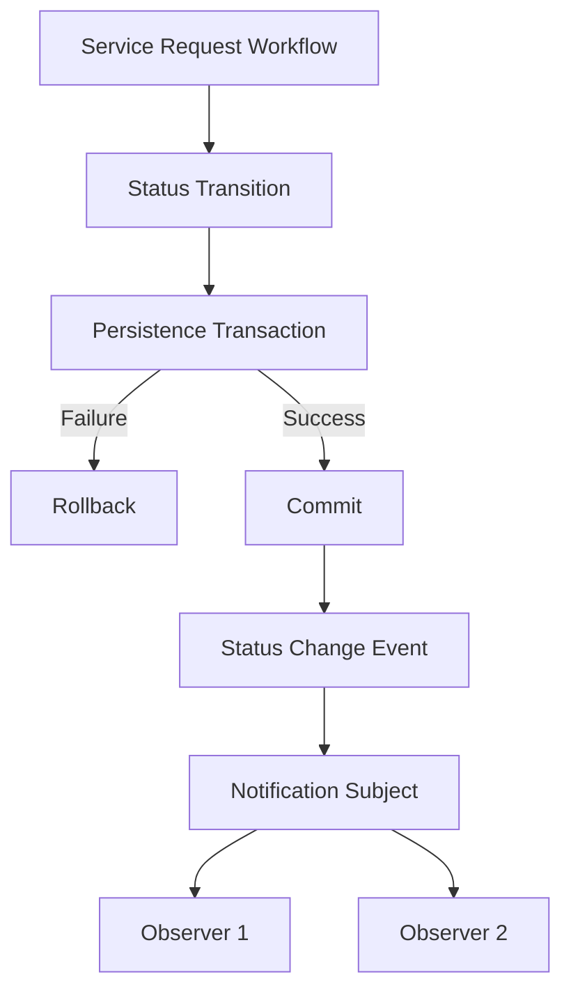

# Interface & Integration Design

## 1. Integration Requirements

CivicConnect requires communication between the service-request workflow and
notification behaviour when a service-request status changes.

The integration design must allow a successful status transition to trigger the
appropriate notification behaviour without tightly coupling the status-transition
logic to individual notification implementations.

The initial integration design should remain proportionate to the current
CivicConnect project scope and should not introduce unnecessary distributed
infrastructure.

## 2. Integration Alternatives Considered

Three initial integration approaches were considered:

| Approach | Description | Advantages | Limitations |
|---|---|---|---|
| In-process method call | The status-transition component directly calls notification functionality. | Simple and easy to implement. | Creates tighter coupling between status processing and notification behaviour. |
| Synchronous REST | The application communicates with a separate notification service through an HTTP API. | Provides a clear service boundary and allows independent components. | Introduces network failures, API management and additional deployment complexity. |
| Asynchronous event/message | The application publishes an event to a messaging mechanism which notification components consume. | Provides loose coupling and asynchronous processing. | Requires additional messaging infrastructure and operational complexity. |

## 3. Initial Integration Decision

For the initial CivicConnect implementation, an **in-process event-based
integration** approach will be used for status-change notifications.

A status-change event will be produced after the related persistence transaction
has successfully committed. Notification observers can then react to the event
without the status-transition component directly depending on individual
notification implementations.

A separate REST notification service or external message broker will not be
introduced at this stage because the current project scope does not require the
additional distributed-system infrastructure.

This decision may be revisited if future requirements introduce sufficient
notification volume, independent deployment requirements or other integration
needs.

## 4. Initial Integration Flow

The initial notification integration follows this sequence:

## 5. Initial Interface Responsibilities

The initial design will separate responsibilities as follows:

| Component | Responsibility |
|---|---|
| Service Request Workflow | Handles the service-request operation and status-transition workflow. |
| Persistence Layer | Stores the service-request, status-history and assignment data. |
| Status-Change Event | Represents a successfully committed status transition. |
| Notification Subject | Publishes the status-change event to registered observers. |
| Notification Observer | Reacts to the status-change event according to its responsibility. |

The exact class names, method signatures and event structure will be refined during
implementation.

## 6. Integration Constraints

The initial integration design must satisfy the following constraints:

- Notification events must only be produced after a successful status-transition
  transaction.
- A failed or rolled-back status transition must not produce a notification event.
- Notification behaviour should not be hard-coded into the core status-transition
  logic.
- The initial design should not require a separate notification server or message
  broker.
- Interfaces should be kept sufficiently small to allow the implementation to be
  tested independently.
- The design may be revisited if future requirements create a need for a different
  integration boundary.

## 7. Evidence and Traceability

The initial integration decision will be evidenced through:

- `ADR-INT-01` documenting the integration alternatives and selected approach.
- A component/integration diagram showing the status-transition and notification
  interaction.
- Application implementation of the status-change event flow.
- Tests confirming that successful status transitions produce notification events.
- Tests confirming that failed transactions do not produce notification events.
- RTM links to the relevant status-tracking and notification requirements.

This integration design is an initial M2 decision and may be refined as the
application implementation develops.
